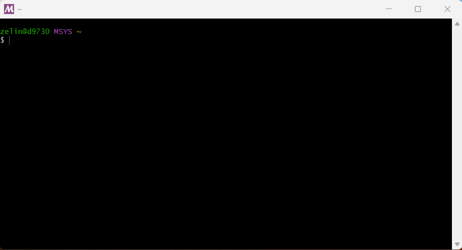
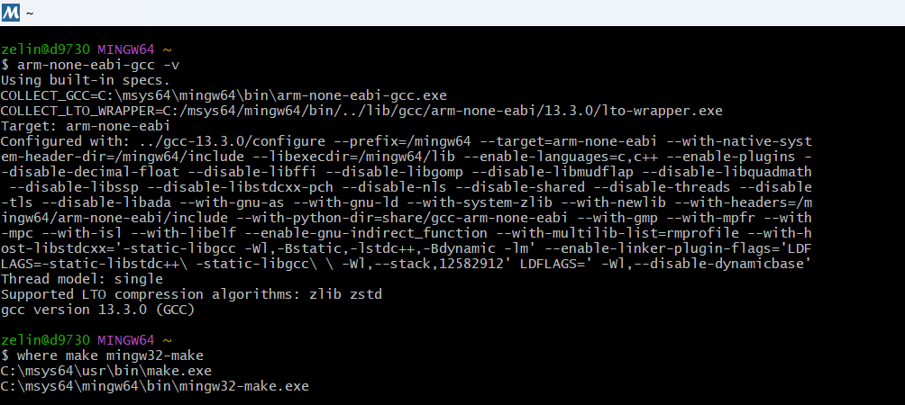
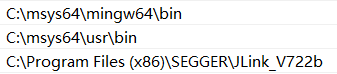
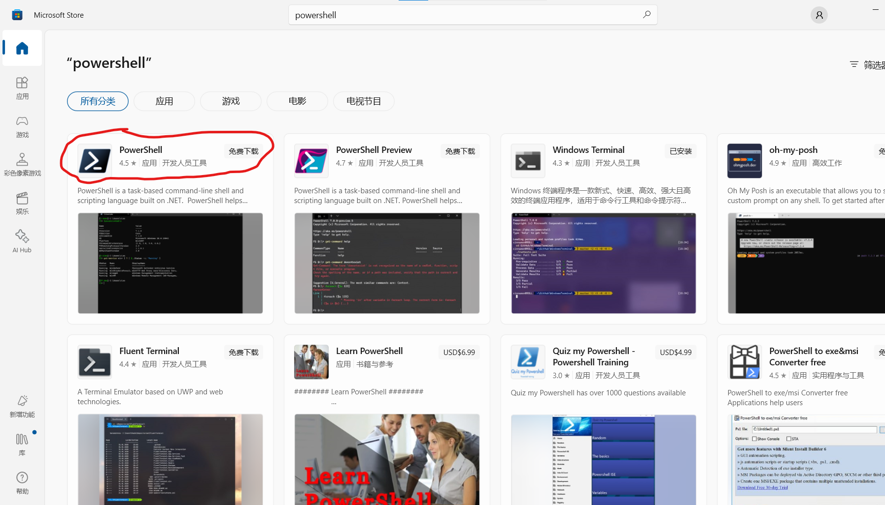
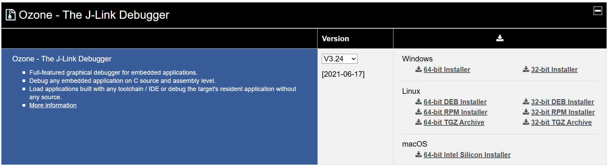
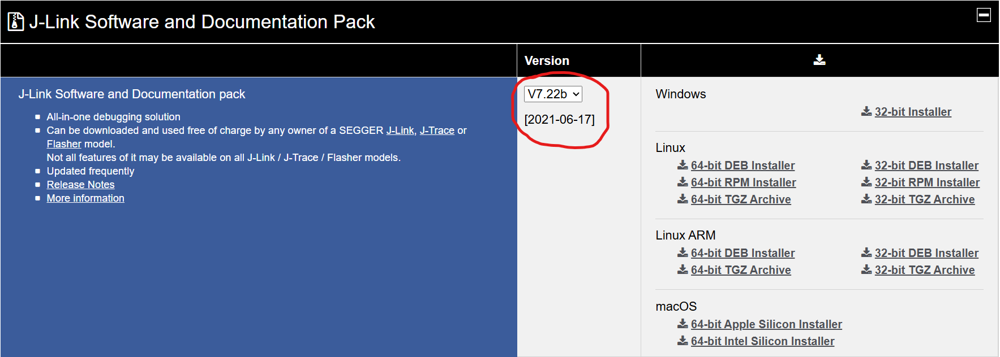

# RG VSCode STM32 Development Environment Setup

**Author:** Zelin Shen (zshen25@vt.edu)

<!-- TOC -->
- [RG VSCode STM32 Development Environment Setup](#rg-vscode-stm32-development-environment-setup)
	- [Windows 10/11 Platform](#windows-1011-platform)
		- [Install  MSYS2 application](#install--msys2-application)
		- [Update \& upgrade in MSYS2](#update--upgrade-in-msys2)
		- [Install build-essential packages in MSYS2](#install-build-essential-packages-in-msys2)
		- [Install PowerShell 7](#install-powershell-7)
		- [Install Ozone V3.24 (32-bit)](#install-ozone-v324-32-bit)
		- [Install J-Link driver \& toolbox V7.22b (32-bit)](#install-j-link-driver--toolbox-v722b-32-bit)
		- [Optional - Install STM32CubeIDE](#optional---install-stm32cubeide)
		- [Optional - Install STm32CubeProgrammer](#optional---install-stm32cubeprogrammer)
		- [Install ST-LINK USB driver signed for Windows](#install-st-link-usb-driver-signed-for-windows)
	- [macOS Platform](#macos-platform)
		- [Install Build-Essentials](#install-build-essentials)
		- [Install ARM Toolchain](#install-arm-toolchain)
		- [Flash and Debug Tools](#flash-and-debug-tools)
	- [Linux - Ubuntu 20.04 / Ubuntu 22.04 Platform](#linux---ubuntu-2004--ubuntu-2204-platform)
	- [All Platform: Visual Studio Code \& STM32CubeMX install](#all-platform-visual-studio-code--stm32cubemx-install)
		- [Install STM32CubeMX](#install-stm32cubemx)
		- [Install  VSCode](#install--vscode)
		- [Install VSCode extensions (plug-ins)](#install-vscode-extensions-plug-ins)
		- [.json and other config](#json-and-other-config)

<!-- /TOC -->

This document supplements and updates the original instructions from **VSCode+Ozone使用方法.md** (this doc is only for Windows) provided by HNU YueLu RM basic_framework (a few images/instructions are reused here). Before starting the installation, it is recommended to have read and understood the following documents:

- **VSCode+Ozone使用方法.md** (only for Windows)

  location: [HNU YueLu RM Gitee repo page](https://gitee.com/hnuyuelurm/basic_framework/blob/master/.Doc/VSCode+Ozone%E4%BD%BF%E7%94%A8%E6%96%B9%E6%B3%95.md) or [VT RG GitHub repo page](https://github.com/RoboGrinder-at-Virginia-Tech/Inf-md-omni-24/blob/main/.Doc/VSCode%2BOzone%E4%BD%BF%E7%94%A8%E6%96%B9%E6%B3%95.md)

- **RG-embed-envir-setup.md** (this document)

**If there are any conflicting installation instructions, follow those specified in RG documentation.**

Doc name end with `-CN` is in Chinese. All necessary files (such as modified .dll files) are available in the [Google drive](https://drive.google.com/drive/folders/1EDAzx1vdhwXCP7GUI3hmYWnqeRYGjdAG?usp=drive_link) or this GitHub repository.


## Windows 10/11 Platform

### Install  MSYS2 application

MSYS2 is package management tool (and to emulate Linux/Unix shell). Download: https://www.msys2.org/ 
Install it to the default directory: `C:\msys64`

### Update & upgrade in MSYS2

After installation, open the **MSYS2 MSYS** shell window and run the following command:




```shell
# Note that in msys2, ctrl+V is not the paste shortcut, it's Ins+Shift. Or you can right-click on an empty space and choose Paste.
pacman -Sy # is equivalent to sudo apt update
pacman -Su # is equivalent to sudo apt upgrade
# or you can can combine to: pacman -Syu
```

When you execute this command for the first time, you'll receive a prompt indicating that the window will close. Enter `Y` to confirm and close the window. After reopening the MSYS2 shell, run `pacman -Su` again.
This is necessary because sometimes critical core packages (like `msys2-runtime`, `bash`, or `pacman`) require an MSYS2 restart before other dependent packages can be updated.

Note: in the MSYS2 environment, you don't need `sudo` to run `pacman` commands by default, as MSYS2 usually operates with the current user's permissions.

### Install build-essential packages in MSYS2

After update & upgrade, open the **MSYS2 MINGW64** shell window and run the following command:


```shell
pacman -S mingw-w64-x86_64-toolchain mingw-w64-x86_64-arm-none-eabi-toolchain mingw-w64-x86_64-ccache  mingw-w64-x86_64-openocd
# when the prompt asks "Enter a selection (default=all)", just hit enter and wait for it to install
pacman -S --needed base-devel # we will use make installed here instead of mingw32-make installed from the previous command
```

Check installation with the following command and output:

```shell
arm-none-eabi-gcc -v
where make mingw32-make # run them in MINGW64 shell window as before
```



Go to Edit the environment system on your computer, in Advanced -> Environment Variables and follow the step below:


Then add: `C:\msys64\mingw64\bin` and `C:\msys64\usr\bin` to systems environment variable `Path` in this order.



### Install PowerShell 7

Open Microsoft Store and download PowerShell (this is different from the Windows PowerShell that come with Windows 10/11); optional: also install Windows Terminal



### Install Ozone V3.24 (32-bit)

Make sure to install this version, V3.24 (32-bit), (link: https://www.segger.com/downloads/jlink/#Ozone), before installing Jlink driver & toolbox




Make sure to s
elect "install a new instance" at this step.

### Install J-Link driver & toolbox V7.22b (32-bit)

Make sure to install this version, V7.22b (32-bit), (link: https://www.segger.com/downloads/jlink/)




Make sure to select/unselect as in the above image during setup. Do NOT check `Update dll in other application`, otherwise jlink will replace the old drivers and startup items in ozone. Never select `Update dll in other application` for any similar app installer/setup.

Copy and paste the JLinkARM.dll downloaded from the google drive into the installation directory of JLink and Ozone and replace the original .dll file (library). The downloaded .dll file (library) are modified so that our advanced jlink debugger/debug probe will not report “The JLink is defective” and “you are using a clone version” errors.

Add `C:\Program Files (x86)\SEGGER\JLink_V722b` to systems environment variable `Path` as well.

### Optional - Install STM32CubeIDE 

Google it (STM32CubeIDE) and install. This includes ST-link and Jlink driver within it's own directory. The app can be used by Cortex-Debug.

###  Optional - Install STm32CubeProgrammer

Google it (STm32CubeProgrammer) and install. It may includes ST-link driver (within it's own directory) and the "ST-link usb driver signed for Windows" (never tested).

They both (cubeIDE & cubeProgrammer) include with ST-link debug probe updater function which could be useful.

### Install ST-LINK USB driver signed for Windows

Google stlink driver download. This page: https://www.st.com/en/development-tools/stsw-link009.html

## macOS Platform

### Install Build-Essentials

`Xcode command line tools` include essential utilities like `gcc`, `make`, and `git`. Installation can be done via command line or through Xcode, with the latter method recommended. Google for detailed instructions on installing Xcode command line tools.

Install `cmake` using Homebrew:

```shell
brew install cmake
```

The later make + arm-none-eabi-gcc requires `zstd` (`libzstd.1.dylib`). Install via Homebrew:

```shell
ls -l /usr/local/lib/libzstd.1.dylib
# If file not found, install zstd:
brew install zstd

# Homebrew automatically creates a symbolic link: /usr/local/opt/zstd -> ../Cellar/zstd/1.5.6
```

### Install ARM Toolchain

Download the arm-none-eabi toolchain from the [official Arm GNU Toolchain downloads page](https://developer.arm.com/downloads/-/arm-gnu-toolchain-downloads).

To install the ARM toolchain to `/opt`, follow these steps:

1. **Extract the downloaded archive to `/opt`**. Assume the downloaded file is `arm-gnu-toolchain-13.3.rel1-darwin-x86_64-arm-none-eabi.tar.xz`:

```shell
sudo tar -xvf arm-gnu-toolchain-13.3.rel1-darwin-x86_64-arm-none-eabi.tar.xz -C /opt/arm-gnu-toolchain/

# Then move extracted contents directly to: /opt. Create /opt first if it does not exist
```

1. **Add the ARM toolchain to the PATH environment variable**. Update your shell profile (`~/.zshrc` or `~/.bash_profile`):

```shell
# Add ARM toolchain to PATH
export PATH="/opt/arm-gnu-toolchain-13.3.rel1-darwin-x86_64-arm-none-eabi/bin:$PATH"
```

1. **Refresh environment variables** by running:

```shell
source ~/.zshrc
```

1. **Verify installation** with:

```shell
arm-none-eabi-gcc --version
```

### Flash and Debug Tools

Instructions pending completion (TODO). Use Homebrew (or other ways) to install OpenOCD and ST-Link drivers.

## Linux - Ubuntu 20.04 / Ubuntu 22.04 Platform

Instructions pending completion (TODO).

## All Platform: Visual Studio Code & STM32CubeMX install

### Install STM32CubeMX

Google it (STM32CubeMX) and install. This app is used to generate STM32 library files.

### Install  VSCode

Google it (Visual Studio Code) and install. In VSCode, it's recommended to sign-in and sync settings/plug-ins.

### Install VSCode extensions (plug-ins)

Install the following plug-ins:

- **C/C++**: provides debugging and code highlighting support for C/C++ files.
- **Better C++ Syntax**: provides richer code highlighting and smart hints.
- **C/C++ Snippets**: provides code block (keyword) completion
- **Cortex-Debug**，**Cortex-Debug: Device Support Pack - STM32F4**: provides debugging support. Cortex-Debug will also automatically help you install some debugging-related plug-ins, including RTOS support, memory view, and global variable live watch.
- **IntelliCode**，**Makfile Tools**: provides project code highlighting support. If you like clang, you can use clangd.


### .json and other config

Notice in the project directory: `.vscode/`
setting.json contains the following configurations:

```json
"cortex-debug.armToolchainPath": "C:\\msys64\\mingw64\\bin",

"cortex-debug.openocdPath": "C:\\msys64\\mingw64\\bin",
"cortex-debug.JLinkGDBServerPath": "C:\\Program Files (x86)\\SEGGER\\JLink_V722b\\JLinkGDBServerCL.exe",
// Only use OpenOCD and J-Link GDB Server as GDB server for cortex-debug. Read in VSCode+Ozone使用方法.md or google what is a gdb server

"cortex-debug.gdbPath": "C:\\msys64\\mingw64\\bin\\gdb-multiarch.exe", // should not use arm-none-eabi-gdb
"cortex-debug.liveWatchRefreshRate": 300,
```

they are for the Cortex-Debug plug-in setting.

Then to enable the livewatch function in cortex-debug, one needs to be enabled it in launch.json. Use `Jlink`debug option as an example:

```json
{
	"name": "Jlink",
	"cwd": "${workspaceFolder}",
	"executable": "${workspaceRoot}\\build\\basic_framework.elf",
	"request": "launch",
	"type": "cortex-debug",
	"device": "STM32F407IG",
	"runToEntryPoint": "main",
	"showDevDebugOutput": "none",
	"servertype": "jlink",
	"interface": "swd",
	"svdFile": "STM32F407.svd",
	// "rtos": "FreeRTOS", // this causes issues with breakpoints when enabled, commented out for all debug options
	"liveWatch": {
		"enabled": true,
		"samplesPerSecond": 3,
	}
	// "preLaunchTask": "build task",// uncomment to build the project before debug
},
```

In VSCode, the default terminal on Windows should be PowerShell 7 (new download), and the default terminal on Mac should be zsh. 
Run make under the project directory and it should compile correctly.

On Windows, make or mingw32-make entered in the msys2 mingw64 shell window should compile no matter what.
